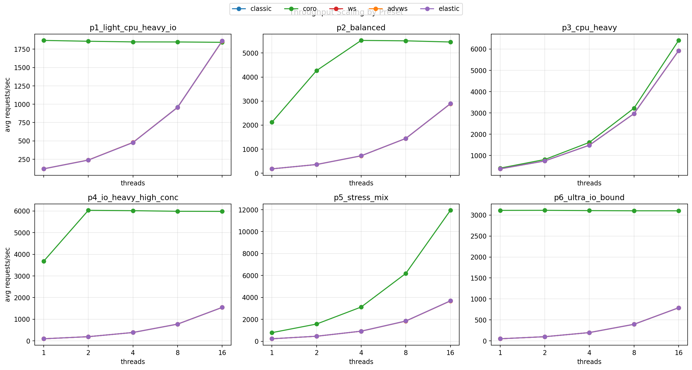
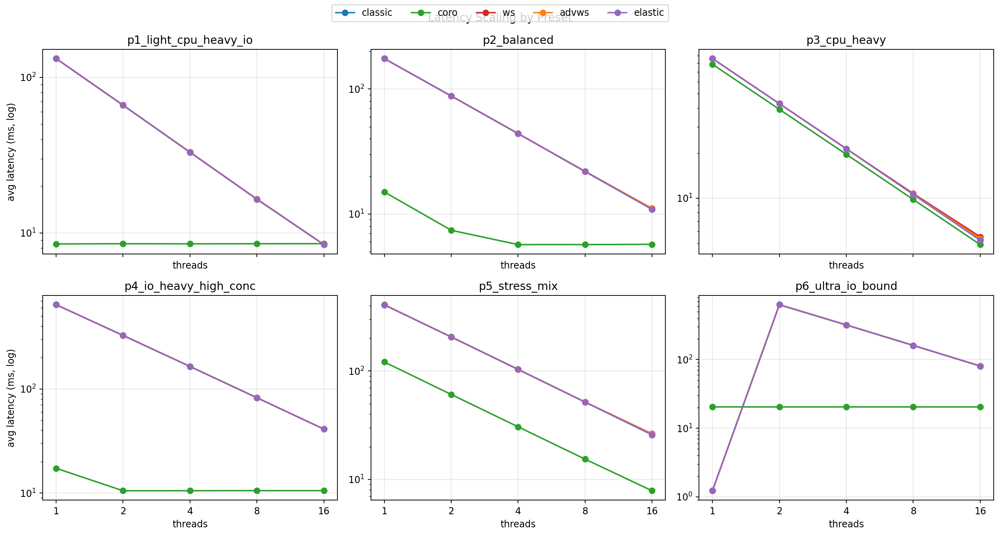
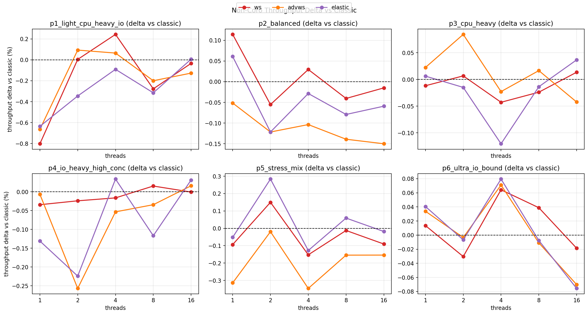
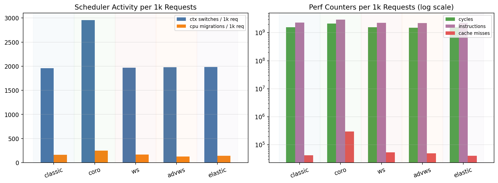

# Mixed HTTP Workload Benchmark

## Headline Results
- Throughput winner count: `coro 29 / 30`, `elastic 1 / 30`
- Geometric mean throughput speedup vs classic: `coro 5.16x`
- Geometric mean latency ratio vs classic: `coro 0.245x` (lower is better)
- Non-coro variants (`classic/ws/elastic/advws`) are near-tied

---

# Main Result: Throughput + Latency

**Takeaway:** `coro` dominates throughput and latency in most presets; biggest gains are in I/O-heavy cases (`p4`, `p6`), smaller in CPU-heavy (`p3`).

---

# Fair Non-Coro Comparison + Perf Interpretation

**How to read Plot 5 (`per_kreq` = per 1,000 requests):**
- Left panel:
  - `ctx switches`: scheduler handoffs between threads/processes (higher = more scheduling overhead)
  - `cpu migrations`: tasks moved across CPU cores (higher = weaker CPU locality)
- Right panel (log scale):
  - `cycles`: total CPU work
  - `instructions`: executed instructions
  - `cache misses`: memory hierarchy misses (higher = worse cache efficiency)
- Interpretation here:
  - `coro` has higher per-request scheduler/cache activity, but still delivers much better throughput/latency overall.
  - Non-coro modes are close to each other, consistent with their small performance deltas.

## Conclusions
- Non-coro pools (`classic/ws/elastic/advws`) are tightly clustered (small deltas vs classic).
- `coro` achieves much higher service-level performance, but with higher scheduler/cache activity per request.
- Recommendation:
  - Max mixed-workload performance: use `coro`
  - If avoiding `coro`: choose among non-coro pools based on engineering tradeoffs (differences are minor).
